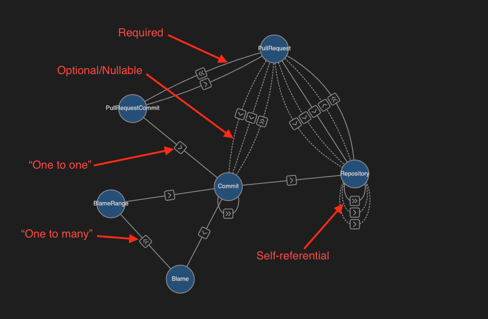

  

<h1 align="center">Domain Graph for VSCode</h1>
<h3 align="center">Beautiful, interactive visualizations for GraphQL schemas</h3>
  

<em>Example showing <a href="https://docs.github.com/en/graphql/overview/public-schema" rel="external">Github's public schema</a></em>

  

## Easily preview schema files 🔎

Use the preview button on .graphql files to open the Domain Graph visualization. Just like previewing markdown files, changes to your schema file will be reflected on the Domain Graph in real-time. Guarenteed to be the best looking API docs on the planet, or your money back!

## Explore your graph 🧭

Intuitively expand and collapses types as you move across your graph. It's a fun, satisfying way to discover the Domain Objects in your API and how they connect to each other.

## Discover deeper nuance 🧠

Drill into specific Domain Objects and Relations to understand individual properties and nuanced descriptions.

## Trust your documetaion ❤️

Gorgeous enough that you won't want to look away, and accurate enough that you don't need to.
By directly rendering your actual GraphQL schema, this documenation is always guarenteed to be lock step with your API—if it's in the schema, then it's in the docs! 😄

 
 

Product of Arizona

🌵

